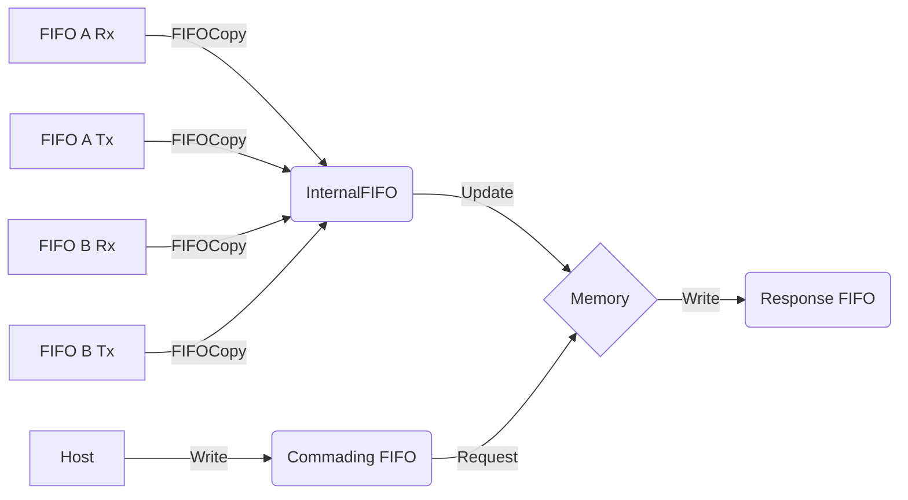

# Health and Status LabView library

This library allows storage of performance metric generated inside
[SCTL](https://knowledge.ni.com/KnowledgeArticleDetails?id=kA00Z000000P8sWSAS&l=en-US).
Access to data stored in FPGA memory is provided with a pair of FIFOs -
commanding and response.

:warning: **Do not call updates every few ticks.** Processing FIFOs takes at
least 6 clock ticks, and you will easily end up overflowing FIFOs. Updating
FIFO every 10 microseconds (400 ticks on 40Mhz clocks) is fine.

To modify content of the memory, you must write commands into
*InternalHealthAndStatusFIFO*. The best is to use provided
*UpdateHealthAndStatus.vi* and provided the FIFO, address offset and base
address, update mode (see below) and data.

In the following table:

* **M** - memory value at **address base + offset**
* **D** - provided data

 Command  | Operation
 -------- | --------------------------------------------------
 Set      | M = D
 Add      | M += D 
 Subtract | M -= D
 Or       | M = M or D *(bitwise or)*
 Not And  | M = M and (not D) *(bitwise; clears bit set with Or)*
 

:warning: You cannot write to commanding FIFO from two different loops. If
that's desired, create FIFO per loop, and use provided
*HealthAndStatusFIFOCopy* to copy the data from 

# Library installation inside LabView project

Three FIFOs needs to be created - one of custom type *HealthAndStatusUpdate*,
one *U16* for commands from host, and one *U64* for replies. Memory block of
*U64* values must be created.

1. Create a target-scoped FIFO of block memory for internal health and status
   usage. Specify the data type as the custom *HealthAndStatusUpdate* cluster.
   Specify never arbitrate for read and always arbitrate for write. When
   specifying the number of elements give some room based on the number of
   functions that will be providing data to the health and status interface.

2. Create a host to target - DMA FIFO for query communications. Specify the
   data type as U16. Specify never arbitrate for read. When specifying the
   number of elements give some room for multiple requests but not too many, a
   value of 4 should be more than enough.

3. Create a target to host - DMA FIFO for query responses. Specify the data
   type as U64. Specify never arbitrate for read. When specifying the number of
   elements make sure to account for the total size of the health and status
   memory. 

4. Create a memory block for health and status storage in the FPGA. Specify
   the data type as U64. When specifying the number of elements make sure to
   take into account all of the address space required for the application.

5. Drop the HealthAndStatus.vi into your main FPGA vi, link up the created
   FIFO's and memory blocks. Provide size large enough to hold all required
   data.

5. Use the internal health and status FIFO for creating update requests which
   are processed by the ProcessHealthAndStatusUpdates.vi. It is recommended to
   create a helper VI for putting the health and status update data onto the
   FIFO. One is provided in the library, it is called UpdateHealthAndStatus.vi.

## Optional - multiple FIFOs

When there is a need to write to the memory from two or more (Single Clock
Timed Loops), a FIFO with the custom type *HealthAndStatusUpdate* must be
created per loop. Use provided *HealthAndStatusFIFOCopy.vi* to copy those FIFOs
to a single FIFO.

# How to use the library

Establish address and offsets mapping. See
[Modbus](https://github.com/lsst-ts/Common_FPGA_Modbus/) for an example of
offset mapping.

## Recording data

When record in the memory shall be created wire into
*UpdateHealthAndStatus.vi*:

* **FIFO** - either the generic, InternalHealthAndStatus, or per-SCTL created FIFO
* **Offset** - number for cell inside per-device records
* **Base address** - constant per module use
* **Operation** - Set, Add, .. see above
* **Data** - see above

:loudspeaker: this will operate on memory cell address **Base address + Offset**

For example, if counting something, use *Add* operation with data 1 to increase
a counter. If working with bite flags (bits set/clear), use *Or* and *Not And*
with bite masks.

## Requesting data

Write to the control FIFO two U16 integers, operation and parameter. See below
for meaning:

|Operation  |  Parameter  | Description                                                                                        |
|-----------|-------------|----------------------------------------------------------------------------------------------------|
|   1       |  Address    | Return single U64 value at address Address.                                                        |
|   2       |  Ignored    | Dump full memory size (wired into *HealthAndStatus.vi*) content. Returns memory size *U64* values. |
|   3       |  Ignored    | Clear memory. Write 0 to all memory cell.                                                          |

Data for operation 1 and 2 are returned on response FIFO as *U64* value(s).
